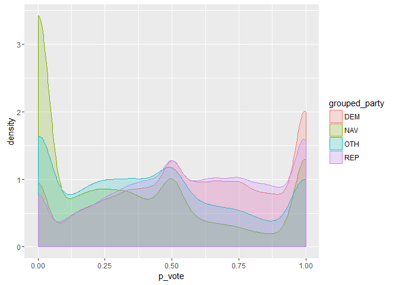

Voter Registration Sample
================
Jay Lee
February 10, 2017

``` r
vote_particip <- read.csv("http://bit.ly/2l1bIxs")
grouped_vote_2 <- vote_particip %>%
  mutate(grouped_party = PARTY_CODE %>%
           replace(!(PARTY_CODE  %in% c("REP", "DEM", "NAV")), "OTH"))

grouped_vote_2$grouped_party <- factor(grouped_vote_2$grouped_party, ordered = TRUE, levels = c("DEM", "REP", "NAV", "OTH"))

ggplot(grouped_vote_2, aes(x = p_vote, col = grouped_party, fill = grouped_party))+
  geom_density(alpha=.2)+
  scale_colour_manual(values=c("steelblue", "tomato3", "darkorchid4", "springgreen4"))+
  scale_fill_manual(values = c("steelblue1", "tomato", "darkorchid1", "springgreen1"))
```


-   For this data, I wanted to know if Republicans and Democrats voted at similar levels throughout the state of Oregon.

-   The p\_vote variable is numeric, and the grouped\_party variable I created is categorical.

-   I used position for p\_vote because I was interested in the varying levels of party density over changing values of p\_vote. I used fill for grouped\_party because party vote was the variable I wanted to compare.

-   I used a density plot because I wanted to see which party had higher values over differing values of p\_vote. A histogram could have worked as well, but to create a smooth and clear plot I chose a density plot.

-   I went through a few preliminary plots before creating this final version. My first plot just tracked Republicans, Democrats, and "Other", to avoid overcrowding the plot with all 11 possible party IDs.

``` r
grouped_vote <- vote_particip %>%
  mutate(grouped_party = PARTY_CODE %>%
  replace(!(PARTY_CODE  %in% c("REP", "DEM")), "OTH"))
ggplot(grouped_vote, aes(x = p_vote, fill = grouped_party))+
  geom_density(alpha=.2)
```


To improve the clarity of this plot, I made the line color of each density plot the same color as its fill. This technically breaks Tufte's rule that there should not be more aesthetics mapped to than variables used, but it enhances clarity where many fill colors overlap.

``` r
ggplot(grouped_vote, aes(x = p_vote, col = grouped_party, fill = grouped_party))+
  geom_density(alpha=.2)
```


Noting the high proportion of "Other" registrees with p\_vote = 0.00, I wanted to see if this was due to non-affiliated voters (NAV) being grouped with those who simply register for a party other than the two major ones.

``` r
grouped_vote_2 <- vote_particip %>%
  mutate(grouped_party = PARTY_CODE %>%
           replace(!(PARTY_CODE  %in% c("REP", "DEM", "NAV")), "OTH"))
ggplot(grouped_vote_2, aes(x = p_vote, col = grouped_party, fill = grouped_party))+
  geom_density(alpha=.2)
```



Finally, I adjusted the variable order, so Democrat and Republican appear first, followed by non-affiliated voters and the Other category. I also adjusted color to make the fill for Democrats blue and that for Republicans red, both to align with general use of these colors and because it would make me a hypocrite to leave that switched after all the complaining I've done about it ¯\_(ツ)\_/¯


-   My final graphic (reprinted above for ease of reference) tells us a number of things about this dataset. First, it shows that members of the two major parties vote at approximately the same rate across the board, with slightly more Democrats at the 0 and 1 values for p\_vote and more Republicans in between these extremes. Reaching very broadly, this seems to coincide with the idea that Republican voters are older (and thus have voted or not in more elections, bringing their p\_vote closer to the middle) and that young people vote Democratic. Many of these 0 or 1 values probably belong to people who are able to vote for the first time.

Next, we see that people who are not registered for the two major parties tend to vote less than those of the major ones. This is no surprise, as many elections only have a Democrat and a Republican on the ballot (if not only one of these, for smaller uncontested elections). If a voter's party has no stake in an election, that voter has less motivation to get out and vote in that election.

Finally, I consider the differences between the plots with and without a separate NAV category (reprinted below). Between these two, we see that removing non-affiliated voters from the "Other" category removes a large amount of the peak at 0 in this category, and shifts the entire distribution of the category towards the right overall. This also seems to coincide with the trend described above. If a voter does not care enough which party wins elections to register for one, that voter likely will have less motivation to vote for candidates from these parties.


