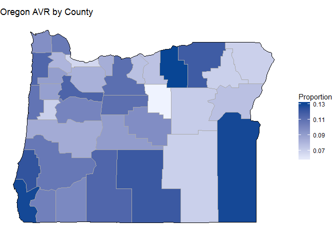
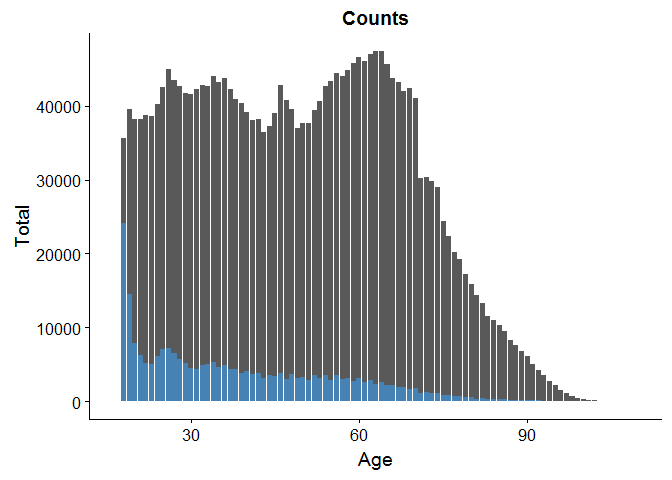
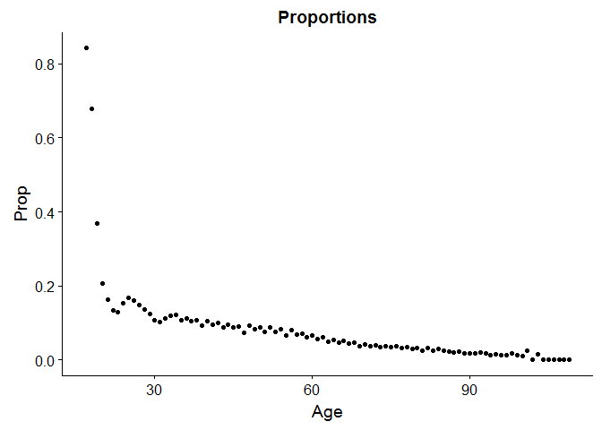
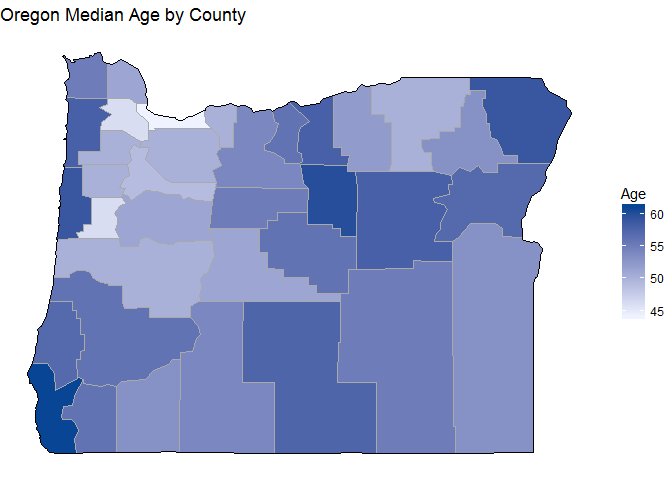

hw\_1\_wrangle
================
Jay Lee
February 12, 2017

First steps: import and tidy the data.

``` r
ORreg <- read_csv("http://bit.ly/2kG37yJ")
```

    ## Parsed with column specification:
    ## cols(
    ##   VOTER_ID = col_integer(),
    ##   BIRTH_DATE = col_character(),
    ##   CONFIDENTIAL = col_character(),
    ##   EFF_REGN_DATE = col_character(),
    ##   STATUS = col_character(),
    ##   PARTY_CODE = col_character(),
    ##   COUNTY = col_character()
    ## )

``` r
ORMV <- read_csv("http://bit.ly/2lCadlB")
```

    ## Parsed with column specification:
    ## cols(
    ##   VOTER_ID = col_integer(),
    ##   DESCRIPTION = col_character(),
    ##   COUNTY = col_character()
    ## )

``` r
# Tidy ORMV, remove duplicates but keep their info
MVcombined <- ORMV %>%
  group_by(VOTER_ID) %>%
  mutate(MV1 = ifelse(DESCRIPTION == "Motor Voter", 1, 0), MV2 = ifelse(DESCRIPTION == "MVPhase2", 1, 0)) %>%
  select(1:5, -2, -3) %>%
  summarise_each(funs(sum))

# Join new MVcombined with ORreg
ORfull <- left_join(ORreg, MVcombined, by = "VOTER_ID")

# Fill in 0 for NA in MV1, MV2
ORfull$MV1[is.na(ORfull$MV1)] <- 0
ORfull$MV2[is.na(ORfull$MV2)] <- 0

# Remove inactive and confidential voters
ORfull <- ORfull %>%
  filter(is.na(CONFIDENTIAL), STATUS == "A")

# Next step is cleaning the dates
ORfull <- ORfull %>%
  mutate(BIRTH_DATE = mdy(BIRTH_DATE), EFF_REGN_DATE = mdy(EFF_REGN_DATE))
```

Now, we manipulate the data for our first plot: AVR by county.

``` r
# Get totals for Motor Voter by county
CountyAuto <- ORfull %>%
  group_by(COUNTY) %>%
  dplyr::summarise(pop = n(), Phase1 = sum(MV1), Phase2 = sum(MV2))

# Create tbl for the duplicate values from above, and add as a new column on CountyAuto
extra <- ORfull %>%
  group_by(COUNTY) %>%
  filter(MV1 == 1, MV2 == 1) %>%
  dplyr::summarise(surplus = n())
CountyAuto <- left_join(CountyAuto, extra, by = "COUNTY")

# Set NAs from the join to 0 in the surplus column
CountyAuto$surplus[is.na(CountyAuto$surplus)] <- 0
CountyAuto <- CountyAuto %>%
  mutate(total = Phase1 + Phase2 - surplus, prop = total / pop)

# Pull OR from the package, since there's more than one "Baker County""
data(county.regions)
OR <- county.regions %>%
  filter(state.name == "oregon")

#Transform CountyAuto to a form choropleth can work with
AutoCounty <- CountyAuto %>%
  select(1,7) %>%
  transmute(county.name = tolower(COUNTY), value = prop)
AutoCounty <-left_join(AutoCounty, OR, by = "county.name") %>%
  select(2:3)

# Make the graph
county_choropleth(AutoCounty, title = "Oregon AVR by County", legend = "Proportion", num_colors = 1, state_zoom = "oregon")
```



For this plot, I was interested in how the number of voters registered through AVR would change by county. Specifically, I wondered if more urban and suburban counties (Multnomah and surrounding counties, namely, but also counties along I-5) would have more or less voters registered through AVR than rural counties (more Eastern). My final data set (CountyAuto) includes categorical data in county.name and numerical data in prop, the proportion of registrees in each county who were registered by AVR. I mapped county to position on a map of Oregon, because counties are a physical descriptor of location. I mapped proportion to color, because that is the easiest secondary aesthetic to map a numerical variable to in this situation. This plot alone did not confirm anything about my question. There appears to be no relationship between county location and proportion of voters registered by AVR.

Next, we manipulate to examine AVR by age.

``` r
# Set current date, calculate age for each case
givendate <- as.Date(c("2017-02-14"))
ORfull <- ORfull %>%
  mutate(AGE = floor(interval(start = BIRTH_DATE, end = givendate) / duration(num = 1, units = "years")))

# Get totals for Motor Voter by age
AgeAuto <- ORfull %>%
  group_by(AGE) %>%
  filter(AGE > 16, AGE < 110) %>%
  dplyr::summarise(pop = n(), Phase1 = sum(MV1), Phase2 = sum(MV2))

# Create tbl for the duplicate values from above, and add as a new column on AgeAuto
extra2 <- ORfull %>%
  group_by(AGE) %>%
  filter(MV1 == 1, MV2 == 1, AGE > 16, AGE < 110) %>%
  dplyr::summarise(surplus = n())
AgeAuto <- left_join(AgeAuto, extra2, by = "AGE")

# Set NAs from the join to 0 in the surplus column
AgeAuto$surplus[is.na(AgeAuto$surplus)] <- 0
AgeAuto <- AgeAuto %>%
  mutate(total = Phase1 + Phase2 - surplus, prop = total / pop)

#Make the graph
ggplot(data = AgeAuto, aes(x = AGE)) +
  geom_bar(aes(y = pop), stat = "identity") + 
  geom_bar(fill = "steelblue", aes(y = total), stat = "identity") +
  xlab("Age") +
  ylab("Total") +
  ggtitle("Counts")
```



``` r
ggplot(data = AgeAuto, aes(x = AGE, y = prop)) +
  geom_point() +
  xlab("Age") +
  ylab("Prop") +
  ggtitle("Proportions")
```



For this plot, I was interested in how the number of voters registered through AVR would change with age. My final data set (AgeAuto) includes numerical data in AGE and numerical data in prop, the proportion of registrees for each age group who were registered by AVR. I mapped Age to the x-axis and Total and Proportion to the y-axes because these were the two main variables I was interested in. Then, I manually mapped type of registration to color, to show the difference between the two. These plots show that a far greater amount of young people are registered through AVR than older people. This makes sense, as many more young people are registering for the first time compared to older people.

Finally, we manipulate to examine AVR by party/age by county.

``` r
# Find summary ages for counties
CountyAge <- ORfull %>%
  group_by(COUNTY) %>%
  dplyr::summarise(pop = n(), mean_age = mean(AGE), median_age = median(AGE))

# Turn into a form choropleth can work with
AgeCounty <- CountyAge %>%
  select(1,4) %>%
  transmute(county.name = tolower(COUNTY), value = median_age)
AgeCounty <-left_join(AgeCounty, OR, by = "county.name") %>%
  select(2:3)

#Make the plot
county_choropleth(AgeCounty, title = "Oregon Median Age by County", legend = "Age", num_colors = 1, state_zoom = "oregon")
```



With this plot, I was interested in a relationship between age and county that might explain some of the distribution shown in the first map. Since young people are registered so much via AVR, it would make sense that counties with a higher proportion of registration might have a younger population overall. My final data set (CountyAge) includes categorical data in county and numerical data in median\_age. This plot didn't really provide an explanation for the question I was interested in. I was expecting counties with more AVR like Malheur County (bottom right corner) would have a younger median age, and similarly if counties with less AVR like Wheeler County (light shade in the upper middle) would have a higher median age. The latter holds in this case, but the former does not. In addition, Multnomah County has the lowest median age in the state but also has one of the lowest rates of AVR.
