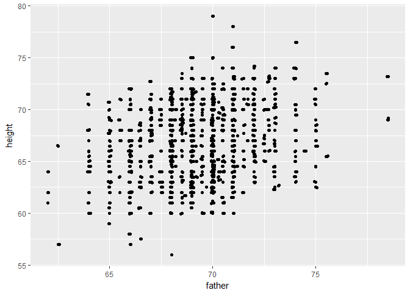
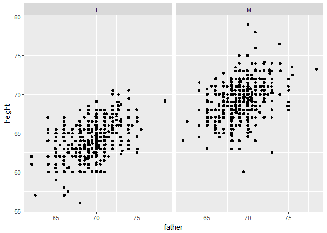
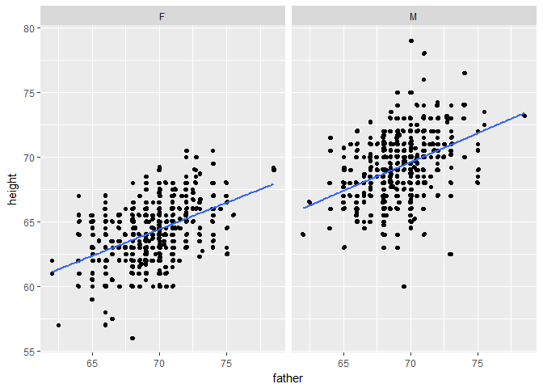
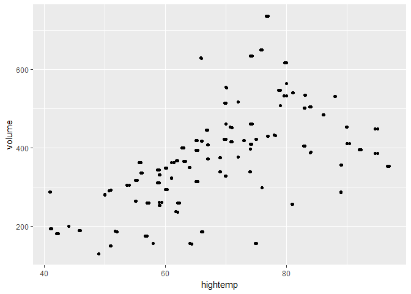
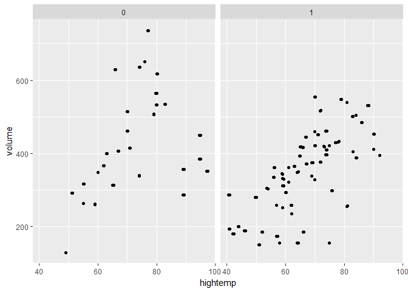
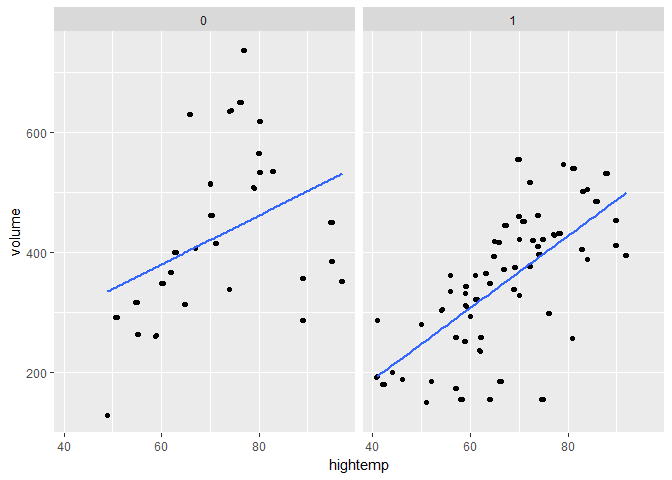
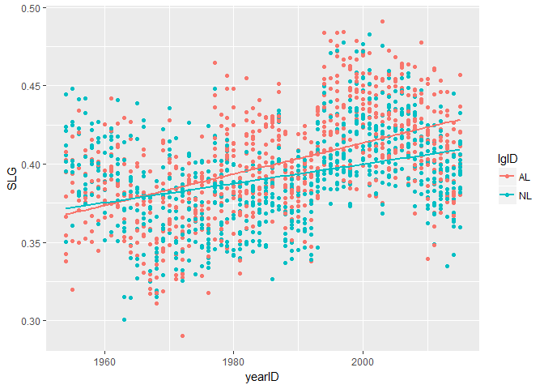

hw\_2\_review
================
Jay Lee
February 23, 2017

### Exercise 3.1

Create a scatterplot of each person's height against their father's height.

``` r
q <- ggplot(Galton, aes(x = father, y = height)) +
  geom_point() +
  geom_jitter()
q
```



Separate your plot into facets by sex.

``` r
q + facet_wrap(~ sex)
```



Add regression lines to all of your facets.

``` r
q + facet_wrap(~sex) +
  geom_smooth(method = "lm", se = F)
```



### Exercise 3.2

Create a scatterplot of the number of crossings per day volume against the high temperature that day.

``` r
r <- ggplot(RailTrail, aes(x = hightemp, y = volume)) +
  geom_point() +
  geom_jitter()
r
```



Separate your plot into facets by weekday.

``` r
r + facet_wrap(~weekday)
```



Add regression lines to the two facets.

``` r
r + facet_wrap(~weekday) +
  geom_smooth(method = "lm", se = F)
```



### Exercise 4.8

Define two new variables in the Teams data frame from the Lahman package: batting average (BA) and slugging percentage (SLG).

``` r
Teams2 <- Teams %>%
  mutate(BA = H / AB, 
         SLG = (H + X2B + 2 * X3B + 3 * HR) / AB)
```

### Exercise 4.9

Plot a time series of SLG since 1954 conditioned by lgID. Is slugging percentage typically higher in the American League (AL) or the National League (NL)? Can you think of why this might be the case?

``` r
Teams3 <- Teams2 %>%
  filter(yearID >= 1954)
ggplot(Teams3, aes(x = yearID, y = SLG)) +
  geom_point(aes(color = lgID)) +
  geom_smooth(method = "lm", aes(color = lgID), se = F)
```



Slugging percentage is typically higher in the AL than in the NL. This makes sense, as the AL utilizes a "designated hitter" position that the NL does not. This player specializes in hitting and doesn't play a defensive position, meaning they generally have higher skill in batting, and thus slugging. This rule was implemented starting in 1973, around when the graph shows the two leagues start to diverge.

### Exercise 4.10

Display the top 15 teams ranked in terms of slugging percentage in MLB history. Repeat this using teams since 1969.

``` r
Teams2 %>%
  arrange(desc(SLG)) %>%
  slice(1:15) %>%
  select(yearID, franchID, SLG)
```

    ##    yearID franchID       SLG
    ## 1    2003      BOS 0.4908996
    ## 2    1927      NYY 0.4890593
    ## 3    1930      NYY 0.4877019
    ## 4    1997      SEA 0.4845030
    ## 5    1894      ATL 0.4843345
    ## 6    1994      CLE 0.4838389
    ## 7    1996      SEA 0.4835921
    ## 8    1936      NYY 0.4834556
    ## 9    2001      COL 0.4829525
    ## 10   1894      BLO 0.4828089
    ## 11   1930      CHC 0.4809174
    ## 12   1995      CLE 0.4787192
    ## 13   1999      TEX 0.4786763
    ## 14   1997      COL 0.4777798
    ## 15   2009      NYY 0.4775618

``` r
Teams2 %>%
  filter(yearID >= 1969) %>%
  arrange(desc(SLG)) %>%
  slice(1:15) %>%
  select(yearID, franchID, SLG)
```

    ##    yearID franchID       SLG
    ## 1    2003      BOS 0.4908996
    ## 2    1997      SEA 0.4845030
    ## 3    1994      CLE 0.4838389
    ## 4    1996      SEA 0.4835921
    ## 5    2001      COL 0.4829525
    ## 6    1995      CLE 0.4787192
    ## 7    1999      TEX 0.4786763
    ## 8    1997      COL 0.4777798
    ## 9    2009      NYY 0.4775618
    ## 10   2000      HOU 0.4766607
    ## 11   2003      ATL 0.4754850
    ## 12   1996      CLE 0.4752684
    ## 13   2000      ANA 0.4724591
    ## 14   1996      COL 0.4724508
    ## 15   2004      BOS 0.4723776

### Exercise 4.11

The Angels have at times been called the California Angels (CAL), the Anaheim Angels (ANA), and the Los Angeles Angels of Anaheim (LAA). Find the 10 most successful seasons in Angels history. Have they ever won the World Series?

``` r
Teams2 %>%
  filter(franchID %in% c("CAL", "ANA", "LAA")) %>%
  select(yearID, teamID, G, W, L, WSWin) %>%
  arrange(desc(W / G)) %>%
  slice(1:10)
```

    ##    yearID teamID   G   W  L WSWin
    ## 1    2008    LAA 162 100 62     N
    ## 2    2002    ANA 162  99 63     Y
    ## 3    2014    LAA 162  98 64     N
    ## 4    2009    LAA 162  97 65     N
    ## 5    2005    LAA 162  95 67     N
    ## 6    2007    LAA 162  94 68     N
    ## 7    1982    CAL 162  93 69     N
    ## 8    1986    CAL 162  92 70     N
    ## 9    2004    ANA 162  92 70     N
    ## 10   1989    CAL 162  91 71     N

The Angels have won one World Series.
