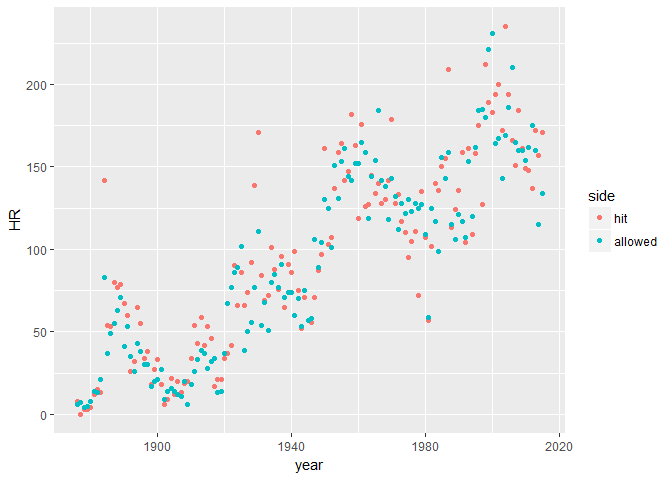

hw\_3\_tidy
================
Jay Lee

-   [Part I](#part-i)
    -   [Exercise 5.1](#exercise-5.1)
    -   [Exercise 5.6](#exercise-5.6)
    -   [Exercise 5.7](#exercise-5.7)
-   [Part II](#part-ii)
    -   [Creating Voter Sample](#creating-voter-sample)
    -   [Tidying Data](#tidying-data)

Part I
------

### Exercise 5.1

``` r
Cubs <- Teams %>%
  filter(teamID == "CHN") %>%
  select(yearID, HR, HRA)
colnames(Cubs) <- c("year", "hit", "allowed")
Cubs <- Cubs %>%
  gather(key = side, value = HR, hit, allowed, factor_key = TRUE)
ggplot(Cubs, aes(x = year, y = HR, color = side)) +
  geom_point() # geom_line crossed itself too many times to be readable
```



### Exercise 5.6

``` r
ds56 <- data.frame(id = c(1,2,3,1,2,3),
                   group = c("T", "T", "T", "C", "C", "C"),
                   vals = c(4.00, 6.00, 8.00, 5.00, 6.00, 10.00))
ds56
```

    ##   id group vals
    ## 1  1     T    4
    ## 2  2     T    6
    ## 3  3     T    8
    ## 4  1     C    5
    ## 5  2     C    6
    ## 6  3     C   10

``` r
Treat <- filter(ds56, group == "T")
Control <- filter(ds56, group == "C")
all <- mutate(Treat, diff = Treat$vals - Control$vals)
all
```

    ##   id group vals diff
    ## 1  1     T    4   -1
    ## 2  2     T    6    0
    ## 3  3     T    8   -2

As verified, the code works for this example. This would not work, however, if the order of `id` was changed. The `mutate` being used is subtracting in order of the index, not in order of the `id` values. Additionally, a missing observation (defined as an entire row missing) would similarly mess up the subtraction. This `all` data set also doesn't show you the control values, which would be good to see how the`diff` column got there. A more robust approach is presented below:

``` r
ds56 %>%
  spread(key = group, value = vals) %>%
  mutate(diff = T - C)
```

    ##   id  C T diff
    ## 1  1  5 4   -1
    ## 2  2  6 6    0
    ## 3  3 10 8   -2

### Exercise 5.7

``` r
ds57 <- data.frame(grp = c("A", "A", "B", "B"),
                   sex = c("F", "M", "F", "M"),
                   meanL = c(.22, .47, .33, .55),
                   sdL = c(.11, .33, .11, .31),
                   meanR = c(.34, .57, .40, .65),
                   sdR = c(.08, .33, .07, .27))
ds57
```

    ##   grp sex meanL  sdL meanR  sdR
    ## 1   A   F  0.22 0.11  0.34 0.08
    ## 2   A   M  0.47 0.33  0.57 0.33
    ## 3   B   F  0.33 0.11  0.40 0.07
    ## 4   B   M  0.55 0.31  0.65 0.27

``` r
ds57 %>%
  gather(key = type, value = val, meanL, sdL, meanR, sdR) %>%
  unite("sex.type", sex, type, sep = ".") %>%
  spread(key = sex.type, value = val)
```

    ##   grp F.meanL F.meanR F.sdL F.sdR M.meanL M.meanR M.sdL M.sdR
    ## 1   A    0.22    0.34  0.11  0.08    0.47    0.57  0.33  0.33
    ## 2   B    0.33    0.40  0.11  0.07    0.55    0.65  0.31  0.27

Part II
-------

### Creating Voter Sample

``` r
setwd("C:/Users/Jay/Desktop/Data Science 241/jay_lee/hw_3_tidy/data")
cd1 <- read_tsv("CD1_VoterHistory_Jan2017.txt")
cd2 <- read_tsv("CD2_VoterHistory_Jan2017.txt")
cd3 <- read_tsv("CD3_VoterHistory_Jan2017.txt")
cd4 <- read_tsv("CD4_VoterHistory_Jan2017.txt")
cd5 <- read_tsv("CD5_VoterHistory_Jan2017.txt")
VoterFile <- rbind(cd1, cd2, cd3, cd4, cd5)
voter_sample <- sample_n(VoterFile, 100000)
rm(cd1, cd2, cd3, cd4, cd5, VoterFile)
```

We have the sample of 100,000 registered voters. Now we tidy the data to organize it.

### Tidying Data

``` r
voter_sample <- voter_sample %>%
  filter(!is.na(VOTER_ID), STATUS == "A")
dim(voter_sample) # Note the number of cases here
```

    ## [1] 85228    65

``` r
length(unique(voter_sample$VOTER_ID)) # This should match the above
```

    ## [1] 85228

``` r
# So, removing the NAs and inactives gives us only unique voter IDs

voter_sample <- voter_sample %>%
  select(1,6:10,13:15,25:27,37:65,-40)

VoterHistory <- voter_sample %>% # Manipulate to get pvote
  select(1,16:40) %>%
  gather(key = date, value = vote, -VOTER_ID,na.rm = T) %>%
  group_by(VOTER_ID) %>%
  summarize(pvote = mean(vote == "YES", na.rm = T))

# Now we have the summarized voter history we want

voter_sample2 <- left_join(voter_sample, VoterHistory, by = "VOTER_ID")

givendate <- as.Date(c("2017-01-01"))
voter_sample2 <- voter_sample2 %>%
  select(-STATUS, -STATE, -(16:40)) %>%
  mutate(BIRTH_DATE = mdy(BIRTH_DATE),
         EFF_REGN_DATE = mdy(EFF_REGN_DATE),
         PARTY_CODE = as.factor(PARTY_CODE),
         CONFIDENTIAL = as.factor(CONFIDENTIAL),
         COUNTY = as.factor(COUNTY),
         AGE = floor(interval(start = BIRTH_DATE, end = givendate) / 
                     duration(num = 1, units = "years")))

str(voter_sample2)
```

    ## Classes 'tbl_df', 'tbl' and 'data.frame':    85228 obs. of  15 variables:
    ##  $ VOTER_ID     : int  484429 300504767 18495314 16600101 100718703 17953849 18548071 11905522 200187911 100586699 ...
    ##  $ BIRTH_DATE   : Date, format: "1947-02-04" "1957-07-30" ...
    ##  $ CONFIDENTIAL : Factor w/ 1 level "Confidential": NA NA NA NA NA NA NA NA NA NA ...
    ##  $ EFF_REGN_DATE: Date, format: "2003-01-03" "2016-12-04" ...
    ##  $ PARTY_CODE   : Factor w/ 11 levels "AME","CON","DEM",..: 6 6 3 10 6 10 10 3 5 4 ...
    ##  $ COUNTY       : Factor w/ 36 levels "BAKER","BENTON",..: 20 15 24 35 9 10 24 26 36 20 ...
    ##  $ RES_ADDRESS_1: chr  "5215 SALAL CT" "482 TAYLOR ST" "785 15TH AVE" "1240 C ST" ...
    ##  $ RES_ADDRESS_2: chr  NA NA NA NA ...
    ##  $ CITY         : chr  "FLORENCE" "ASHLAND" "STAYTON" "FOSSIL" ...
    ##  $ ZIP_CODE     : chr  "97439" "97520" "97383" "97830" ...
    ##  $ ABSENTEE_TYPE: chr  NA NA NA NA ...
    ##  $ PRECINCT_NAME: chr  "4500" "002 Ashland" "655" "FOS" ...
    ##  $ PRECINCT     : chr  "4500" "002" "655" "01" ...
    ##  $ pvote        : num  0.4 0.04 0.76 0.48 0 0.56 0.44 0.56 0.04 0.08 ...
    ##  $ AGE          : num  69 59 75 65 20 74 64 40 54 36 ...
