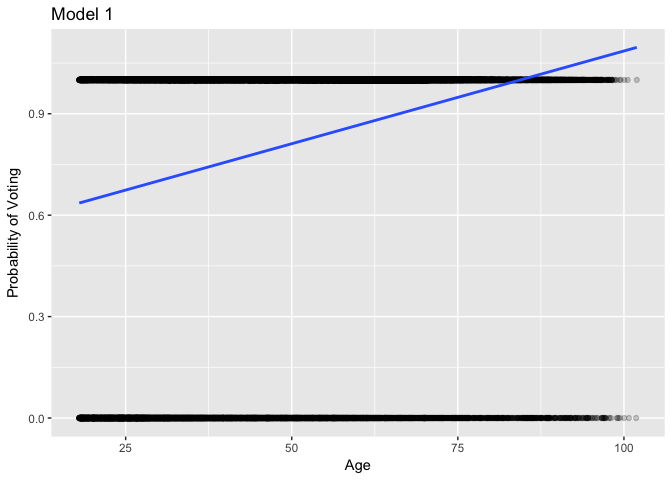
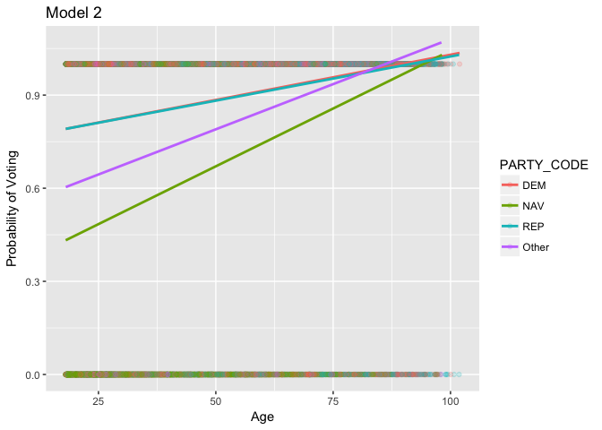

hw\_5\_logit
================
Jay Lee
March 27, 2017

### Set Up Voter File

``` r
ORreg <- read_csv("http://people.reed.edu/~gronkep/or_reg/or_voter.csv")
```

    ## Parsed with column specification:
    ## cols(
    ##   .default = col_character(),
    ##   VOTER_ID = col_integer(),
    ##   ZIP_CODE = col_integer()
    ## )

    ## See spec(...) for full column specifications.

    ## Warning: 1 parsing failure.
    ##     row col   expected     actual                                                  file
    ## 2941547  -- 40 columns 25 columns 'http://people.reed.edu/~gronkep/or_reg/or_voter.csv'

``` r
# The final line in the file (2941547) is missing dashes for the last 15 columns (election date)
set.seed(16)
ORreg <- ORreg %>% sample_n(100000)
set.seed(4564)
```

``` r
# Full voter file loaded as ORreg
ORvote <- ORreg %>%
  filter(STATUS == "A", `11/08/2016` != "-") %>%
  select(VOTER_ID:BIRTH_DATE.x, PARTY_CODE:SPLIT, `11/08/2016`)
birthdate <- mdy(ORvote$BIRTH_DATE.x)
givendate <- ymd(c("2016-11-08"))
ORvote <- ORvote %>%
  mutate(age = interval(start = birthdate, end= givendate) / duration(num = 1, units = "years"),
         # Calculate age at the election date
         vote = ifelse(`11/08/2016` ==  "YES", 1, 0),
         # Turn vote into a dummy variable
         PARTY_CODE = as.factor(PARTY_CODE),
         # Factor the party ID (character value)
         PARTY_CODE = fct_lump(PARTY_CODE, n = 3)) %>%
         # Group parties into REP, DEM, NAV, and Other
  filter(age < 120)

# Check that everything is covered
unique(ORvote$`11/08/2016`)
```

    ## [1] "YES" "NO"

``` r
train_indices <- sample(1:nrow(ORvote), size = floor(nrow(ORvote)/2), replace = F)
ORtrain <- slice(ORvote, train_indices)
ORtest <- slice(ORvote, -train_indices)
```

### 1. vote ~ age

``` r
m1 <- glm(vote ~ age, data = ORtrain, family = binomial)
y1 <- predict(m1, newdata = ORtest, type = "response")
ORtest <- ORtest %>%
  mutate(p_hat1 = y1,
         pred_vote1 = p_hat1 > .5)
confusion_mat1 <- ORtest %>%
  group_by(vote, pred_vote1) %>%
  tally()
false_pos1 <- confusion_mat1[1, 3]
total_obs <- nrow(ORtest)
mcr1 <- false_pos1/total_obs
```

### 2. vote ~ age + party

``` r
m2 <- glm(vote ~ age + PARTY_CODE, data = ORtrain, family = binomial)
y2 <- predict(m2, newdata = ORtest, type = "response")
ORtest <- ORtest %>%
  mutate(p_hat2 = y2,
         pred_vote2 = p_hat2 > .5)
confusion_mat2 <- ORtest %>%
  group_by(vote, pred_vote2) %>%
  tally()
false_pos2 <- confusion_mat2[2, 3]
false_neg2 <- confusion_mat2[3, 3]
mcr2 <- (false_pos2 + false_neg2)/total_obs
```

### 3. vote ~ age + party + county

``` r
m3 <- glm(vote ~ age + PARTY_CODE + COUNTY.x, data = ORtrain, family = binomial)
y3 <- predict(m3, newdata = ORtest, type = "response")
ORtest <- ORtest %>%
  mutate(p_hat3 = y3,
         pred_vote3 = p_hat3 > .5)
confusion_mat3 <- ORtest %>%
  group_by(vote, pred_vote3) %>%
  tally()
false_pos3 <- confusion_mat3[2, 3]
false_neg3 <- confusion_mat3[3, 3]
mcr3 <- (false_pos3 + false_neg3)/total_obs
```

### 4. vote ~ age + I(age^2)

``` r
m4 <- glm(vote ~ age + I(age^2), data = ORtrain, family = binomial)
y4 <- predict(m4, newdata = ORtest, type = "response")
ORtest <- ORtest %>%
  mutate(p_hat4 = y4,
         pred_vote4 = p_hat4 > .5)
confusion_mat4 <- ORtest %>%
  group_by(vote, pred_vote4) %>%
  tally()
false_pos4 <- confusion_mat4[2, 3]
mcr4 <- false_pos4/total_obs
```

### Results

``` r
mcr <- rbind(mcr1, mcr2, mcr3, mcr4)
tidy <- rbind(tidy(m1),
              tidy(m2),
              tidy(m3),
              tidy(m4))
tidy <- tidy %>%
  filter(term %in% c("(Intercept)", "age")) %>%
  select(1:2)
model <- c(1,1,2,2,3,3,4,4)
tidy <- cbind(model, tidy)
tidy <- tidy %>%
  spread(key = term, value = estimate)
tidy <- cbind(tidy, mcr)
tidy <- rename(tidy, mcr = n)
kable(tidy)
```

|  model|  (Intercept)|        age|        mcr|
|------:|------------:|----------:|----------:|
|      1|   -0.3180561|  0.0378882|  0.1907686|
|      2|    0.5518325|  0.0310166|  0.1789176|
|      3|    0.3232457|  0.0320050|  0.1784618|
|      4|   -1.6732740|  0.1042915|  0.1891853|

Compared to a baseline model of "everybody votes" (misclassification rate of 19.25%, `1 - turnout`), model 1 does no better, model 4 does minutely better, and models 2 and 3 have a significant improvement. Models 1-3 (with only a linear `age` term) all have a similar coefficient for `age`, while Model 4 (with a quadratic term as well) has a coefficient about 3 times larger than the other three models. Below are plots of models 1 and 2.

``` r
ggplot(ORtest, aes(x = age, y = vote)) +
  geom_point(alpha = .2) +
  geom_smooth(method = "lm", se = F) +
  labs(title = "Model 1",
       x = "Age",
       y = "Probability of Voting")
```



Model 1 shows that as age increases, probability of voting increases as well. For every one year increase in an arbitrary person's age, the model calculates they are about 3.7 percentage points more likely to vote. The issue with this model is it predicts a p\_hat of over 50% for each voter, as shown below.

``` r
min(ORtest$p_hat1)
```

    ## [1] 0.5901426

As such, any voter who did not vote in this election is characterized as a "false positive", since the model predicts every person will vote. Similarly, there are no "false negative" mistakes in the opposite direction. Overall, not a terribly useful model. One way to account for this is to increase our threshold past `p_hat = .5` to predict who will vote or not.

``` r
ggplot(ORtest, aes(x = age, y = vote, col = PARTY_CODE)) +
  geom_point(alpha = .2) +
  geom_smooth(method = "lm", se = F) +
  labs(title = "Model 2",
       x = "Age",
       y = "Probability of Voting")
```



``` r
# Couldn't get this to match the calculated model in time
```

Model 2 shows the relationship between age, party ID, and the probability of voting. As we see from the graph, Republicans and Democrats vote at similar rates among the same age range, while non-affiliated voters (NAV) and minor-party members vote at lower rates across the board.

In Model 3, the only significant difference is that voters in Benton County vote at higher rates than voters in Baker County, the baseline. Model 4 , with an additional `age^2` term, performed only marginally better than Model 1.
